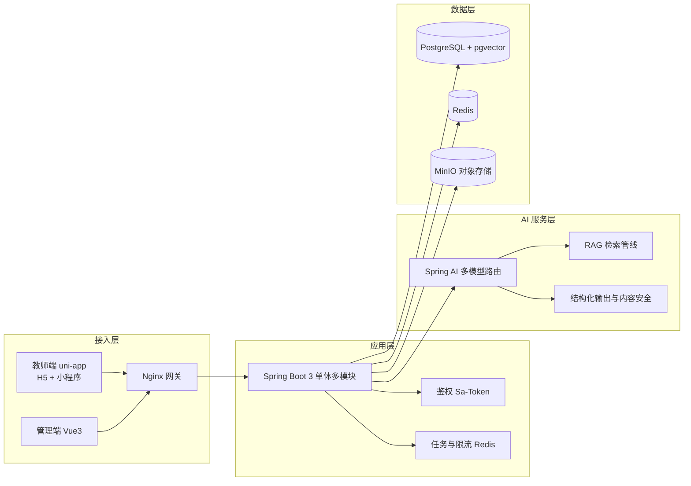
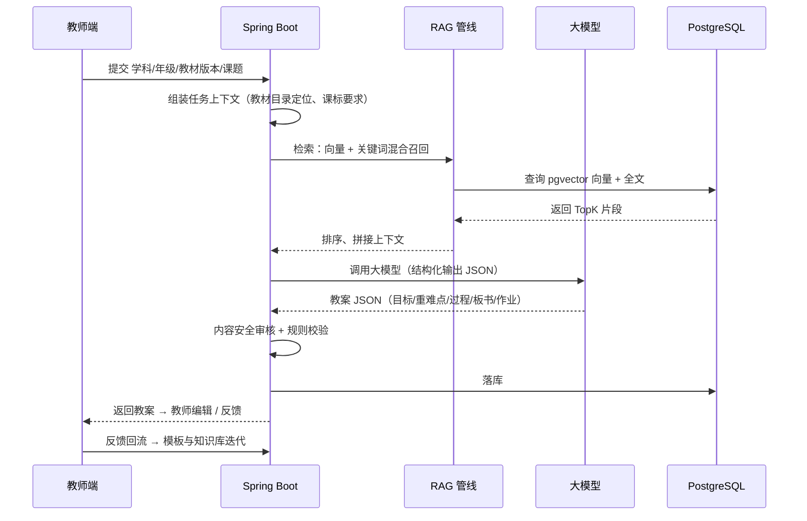

# 「杏坛智备」乡村教师 AI 备课助手 — 项目架构设计（v0.1）

> 中国国际大学生创新大赛（原"互联网+"）2027 备赛
> 赛道：青年红色筑梦之旅 · 创意组
> 文档状态：待团队确认后进入开发
> 更新日期：2026-08-07

---

## 0. 项目定位

**一句话**：为乡村教师提供"新课标对齐、教材适配、即问即得"的 AI 备课助手，让每一节乡村课都备得起、备得好。

- **目标用户**：乡镇 / 农村中小学教师（常有一人多科、跨年级代课）、教研员、学校管理者。
- **核心价值**：
  - 教师侧：备课从"查资料 2~3 小时"降到"AI 辅助 20~30 分钟"，教案结构合规、可直接修改使用；
  - 学校侧：沉淀校本资源库，形成跨校教研共同体；
  - 社会侧：缓解乡村教师结构性缺编与教学资源不均问题，助力教育公平。
- **赛道叙事（红旅）**：立足新乡周边乡村教育一线真问题，用"人工智能 + 软件工程"能力提供可落地、可复制、可度量的数字化支教方案。

**暂定项目名**：「杏坛智备」（杏坛典出孔子讲学处，契合乡村教育 + 红旅底色；最终名称可在备赛材料阶段再打磨）。

---

## 1. 用户场景与功能清单

### 1.1 典型场景

- 场景 A：一位乡村语文老师接到临时代课任务，需要在 40 分钟内完成一节课的教案 + 课件大纲；
- 场景 B：教研员组织跨校"同课异构"，需要批量生成对比教案；
- 场景 C：学校建立校本资源库，沉淀优秀教案供全校复用。

### 1.2 MVP 功能（2026-12 前完成）

**教师端（移动优先，H5 + 微信小程序二期）**

- 微信 / 手机号登录；
- 按"学科-年级-教材版本-单元课题"一键生成教案（核心素养目标、重难点、教学过程、板书、作业设计）；
- 教案二次编辑、重新生成、保存 / 导出（Word / PDF）；
- 课件大纲生成、课堂活动建议、习题生成（含答案与解析）；
- 历史记录与"我的教案库"；
- 使用反馈（一键"用得上 / 需修改"）。

**管理端（Web）**

- 用户 / 学校 / 班级管理；
- 知识库管理（课标、教材目录、教案模板、乡土案例）；
- 使用数据看板（生成量、活跃教师、节省时长估算、好评率）；
- 内容审核（敏感词 + 人工抽检）。

**运营支持**

- 用量统计与导出（为省赛 / 国赛材料提供真实运营数据）。

### 1.3 V2+（2027-01 之后）

- 学情分析：作业数据导入 → 班级薄弱点 → 备课建议；
- 跨校教研广场：教案共享、评论、同课异构；
- 语音输入（乡村教师打字不便）、离线缓存；
- 场景延伸：同一技术底座可扩展到乡村养老政策问答、农技问答（写入商业计划书作为平台叙事）。

---

## 2. 总体技术架构



**设计原则**

- **单体多模块优先**：不引入微服务，降低运维复杂度，2 人开发可维护；
- **AI 能力松耦合**：模型供应商可插拔，避免绑定单一 API；
- **数据飞轮**：每次生成 + 教师反馈回流知识库，形成"用得越多越好用"的壁垒；
- **轻量部署**：一台云服务器 + Docker Compose 即可跑通全栈，便于真实试点。

---

## 3. 技术选型表

| 层 | 选型 | 理由 | 备选 |
| --- | --- | --- | --- |
| 后端 | Java 17 + Spring Boot 3.x + MyBatis-Plus | 团队最熟，生态成熟 | Spring Data JPA |
| AI 框架 | Spring AI 1.x | 与 Spring 无缝集成，原生支持 OpenAI 兼容接口 | 自研 HttpClient 封装 |
| 大模型 | DeepSeek + 通义千问（双供应商容灾） | 中文教案生成质量好、成本低 | 智谱 GLM、Kimi |
| Embedding | 通义 text-embedding-v3 / BGE-M3 | 中文语义效果好 | 硅基流动 BGE-M3 |
| 向量库 | PostgreSQL 16 + pgvector | 一套库搞定关系数据 + 向量，运维简单 | Qdrant |
| 缓存 / 队列 | Redis 7 | 会话、限流、异步任务 | - |
| 对象存储 | MinIO（本地部署） | 免费，后续可平滑切阿里云 OSS | 阿里云 OSS |
| 鉴权 | Sa-Token + JWT | 国内生态、上手快 | Spring Security |
| 教师端 | uni-app（Vue3） | 一套代码出 H5 + 小程序，乡村适配好 | 纯 Vue3 H5 |
| 管理端 | Vue3 + Vite + Element Plus | 团队熟悉 | Ant Design Vue |
| 部署 | Docker Compose + Nginx + HTTPS | 一键部署、可复现 | 宝塔面板 |
| 文档 | 本仓库 docs/ + 飞书/语雀 | 备赛材料沉淀 | - |

---

## 4. 后端模块划分（Maven 多模块）

| 模块 | 职责 |
| --- | --- |
| common | 通用工具、统一返回、全局异常 |
| system | 用户、角色、学校、班级 |
| kb | 知识库：文档上传 / 解析 / 分块 / 向量化 |
| ai | 对话、教案生成、结构化输出、多模型路由 |
| lesson | 教案、习题、课件大纲、导出 |
| stats | 埋点、看板数据 |
| admin | 管理端接口 |
| infra | MinIO、微信配置、短信 |

---

## 5. 核心流程：AI 备课



---

## 6. 数据库设计（核心表）

| 表 | 说明 | 关键字段（示例） |
| --- | --- | --- |
| user | 用户 | id, phone, role, status |
| teacher_profile | 教师档案 | user_id, school_id, subjects, grades |
| school | 学校 | id, name, region, level, type |
| class_group | 班级 | id, school_id, grade, class_name |
| kb_document | 知识库文档 | id, title, type(课标/教材/教案/案例), version, status |
| kb_chunk | 文档分块 | id, doc_id, seq, content, embedding vector |
| prompt_template | 提示词模板 | id, scene, version, template, config |
| generation_task | 生成任务 | id, user_id, scene, params, model, status, cost |
| lesson_plan | 教案 | id, task_id, title, subject, grade, textbook, content_json |
| exercise | 习题 | id, lesson_plan_id, type, content, answer, analysis |
| usage_log | 使用埋点 | id, user_id, action, scene, created_at |
| feedback | 反馈 | id, user_id, lesson_plan_id, type, content |
| survey | 调研记录 | id, school_id, round, metric, value |

> 完整建表 SQL 在脚手架阶段生成，纳入 `db/` 目录。

---

## 7. 部署架构

单机 Docker Compose：

```text
Nginx (80/443) → 前端静态资源 + /api 反代 → Spring Boot
                                                  ├── PostgreSQL + pgvector
                                                  ├── Redis
                                                  └── MinIO
```

- 服务器：阿里云轻量应用服务器 2C4G（学生优惠，约 100~300 元/年）；
- 域名 + 免费 HTTPS 证书；
- 备份：pg_dump 定时任务 + MinIO 对象版本；
- 模型 API 成本：每月约 50~100 元（充分利用免费额度 + 结果缓存）。

---

## 8. 开发路线图与备赛时间线

| 时间 | 阶段 | 关键交付 |
| --- | --- | --- |
| 2026-08 | 定题 | 本架构文档确认、补齐第 3 人、洽谈试点学校、指导老师定软著/专利渠道 |
| 2026-09~11 | MVP 开发 | 登录、教师工作台、教案生成（RAG）、历史记录、基础管理端；提交软著 1 |
| 2026-12 | MVP 收口 | 试点学校部署试用、采集第一批真实数据；提交软著 2 材料 |
| 2027-01 | V2 + 材料 | 学情分析 / 教研广场开发；商业计划书初稿；专利交底书 |
| 2027-02~03 | 校赛冲刺 | 路演 PPT、Demo 视频、数据看板、试点成果材料（照片/证明/报道） |
| 2027-04~07 | 报名与省赛 | 大赛官网报名、省赛材料提交（BP、视频、佐证）、省赛网评 |
| 2027-08 | 省赛现场 | 冲省金，力争晋级国赛 |
| 2027-09 | 国赛 | 国赛网评 / 现场赛 |

> 具体时间以教育部 2027 年正式通知为准（2026 年节奏：报名 4-7 月、省赛 8 月中旬前、国赛 9 月）。

---

## 9. 知识产权与佐证材料计划

- **软著 1**：教师端系统（2026-09 提交，约 1~2 个月拿证）；
- **软著 2**：AI 备课引擎（2026-11 提交）；
- **软著 3**：教研管理平台（2027-01 提交）；
- **实用新型专利**：教案生成 / 备课交互相关（2026-10 交底，2027-01 申请，授权周期 6~9 个月，至少拿到受理通知）；
- **佐证材料**：试点合作协议、使用数据报告、教师调研问卷、学校感谢信、校媒/地方媒体报道；
- **可选**：教研论文、教育局推荐函。

---

## 10. 团队分工（3 + 1）

| 角色 | 人选 | 职责 |
| --- | --- | --- |
| 项目负责人 / 后端 | 你 | 后端、AI 集成、部署、答辩技术主讲 |
| 前端 | 队友 B | uni-app 教师端、管理端、测试 |
| 材料与路演 | 待招成员 C（经管/设计/文传） | 商业计划书、PPT、路演、调研与材料 |
| 指导老师 | 已定 | 合作单位、软著/专利渠道、行业背书、答辩指导 |

> 大赛规定团队 3~15 人（含负责人），当前 2 人必须补齐至少 1 人。

---

## 11. 风险与对策

| 风险 | 对策 |
| --- | --- |
| 模型 API 成本 / 稳定性 | 双供应商 + 结果缓存 + 限流 + 免费额度 |
| 教案质量不可控 | 课标强约束提示词 + 结构化校验 + 教师反馈闭环 + 人工抽检 |
| 试点学校难落地 | 双通道：学校团委/支教组织 + 指导老师校企资源 |
| 被质疑"AI 套壳" | 创新点显性化：新课标对齐引擎、教材版本适配、乡土案例库、教师共建数据飞轮 |
| 时间冲突 | MVP 砍功能清单 + 每周固定开发节奏 |

---

## 12. 待确认事项（进入开发前）

1. 技术选型是否按默认推荐执行（uni-app + PostgreSQL/pgvector + DeepSeek/通义 + MinIO）；
2. 项目名暂定「杏坛智备」是否可接受；
3. 第三位队员的推荐方向：经管 / 设计 / 文传；
4. 试点学校洽谈负责人（建议指导老师牵头，你们带可演示 Demo 去谈）。
